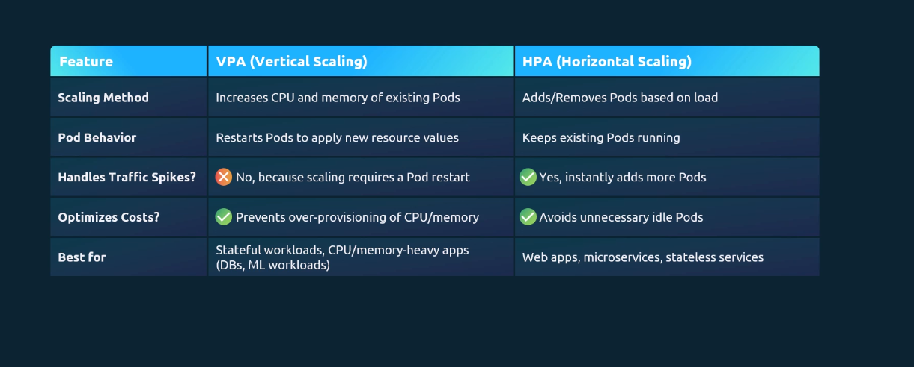

# Hướng dẫn chi tiết về HPA và VPA trong Kubernetes

Trong Kubernetes (K8s), để hệ thống tự động ứng phó với lượng tải
(traffic) tăng giảm thất thường mà không cần sự can thiệp thủ công của
con người, chúng ta sử dụng các cơ chế **Autoscaling (Tự động mở
rộng)**. Có hai cơ chế cốt lõi ở cấp độ Pod: **HPA** và **VPA**.

------------------------------------------------------------------------

## 1. HPA (Horizontal Pod Autoscaler) - Mở rộng theo chiều ngang

HPA là cơ chế tự động tăng hoặc giảm số lượng Pods (replicas) của một
ứng dụng (thường là Deployment, ReplicaSet hoặc StatefulSet) dựa trên
các chỉ số tài nguyên quan sát được.

### Cách thức hoạt động

-   HPA liên tục theo dõi các chỉ số (ví dụ: CPU, Memory) thông qua
    Metrics Server.
-   Nếu mức sử dụng trung bình của các Pod vượt qua một ngưỡng bạn cấu
    hình (ví dụ: CPU \> 80%), HPA sẽ ra lệnh tạo thêm Pod mới để chia sẻ
    tải.
-   Khi tải giảm xuống, HPA sẽ tự động xóa bớt Pod đi để tiết kiệm tài
    nguyên.

**Ví dụ thực tế:**\
Giống như một siêu thị, khi hàng đợi thanh toán quá dài, quản lý sẽ lập
tức mở thêm nhiều quầy thu ngân mới.

### Đặc điểm

**Điểm mạnh:** - Giúp ứng dụng chịu tải cực tốt mà không gây gián đoạn
dịch vụ (Zero downtime). - Các Pod mới được thêm vào mượt mà và load
balancer sẽ tự động chia tải.

**Hạn chế:** - Ứng dụng bắt buộc phải thiết kế theo kiến trúc Stateless
(không lưu trữ trạng thái cục bộ).

### Ví dụ file cấu hình YAML (HPA)

``` yaml
apiVersion: autoscaling/v2
kind: HorizontalPodAutoscaler
metadata:
  name: php-apache-hpa
spec:
  scaleTargetRef:
    apiVersion: apps/v1
    kind: Deployment
    name: php-apache
  minReplicas: 1
  maxReplicas: 10
  metrics:
  - type: Resource
    resource:
      name: cpu
      target:
        type: Utilization
        averageUtilization: 50
```

------------------------------------------------------------------------

## 2. VPA (Vertical Pod Autoscaler) - Mở rộng theo chiều dọc

VPA là cơ chế tự động tăng hoặc giảm giới hạn tài nguyên (CPU và RAM)
được cấp phát cho một Pod cụ thể thay vì tạo ra thêm các Pod mới.

### Cách thức hoạt động

-   VPA theo dõi mức tiêu thụ tài nguyên thực tế của Pod theo thời gian.
-   Nếu phát hiện Pod bị OOMKilled hoặc thiếu CPU trầm trọng, VPA sẽ đề
    xuất mức tài nguyên lớn hơn.
-   Nếu Pod được cấp quá nhiều tài nguyên nhưng không dùng hết, VPA sẽ
    tự động thu hẹp lại.

**Ví dụ thực tế:**\
Thay vì mở thêm quầy thu ngân, quản lý quyết định nâng cấp thiết bị cho
quầy hiện tại để xử lý nhanh hơn.

### Đặc điểm

**Điểm mạnh:** - Phù hợp cho ứng dụng Stateful (Database như MySQL,
PostgreSQL) hoặc Monolith. - Không cần đoán trước mức requests/limits
tối ưu.

**Hạn chế (Quan trọng):** - Để áp dụng cấu hình CPU/RAM mới, VPA phải
restart Pod. - Có thể gây gián đoạn dịch vụ (downtime) ngắn.

------------------------------------------------------------------------

## 3. Bảng so sánh HPA và VPA

  ------------------------------------------------------------------------
  Tiêu chí          HPA (Horizontal)             VPA (Vertical)
  ----------------- ---------------------------- -------------------------
  Hành động cơ bản  Thêm / Bớt số lượng Pods     Tăng / Giảm CPU, RAM của
                                                 1 Pod

  Loại ứng dụng phù Web, API, Microservices      Database, Monolith
  hợp               (Stateless)                  (Stateful)

  Gián đoạn dịch vụ Không                        Có (Restart Pod)

  Giới hạn mở rộng  Giới hạn bởi tài nguyên toàn Giới hạn bởi tài nguyên 1
                    Cluster                      Node
  ------------------------------------------------------------------------

------------------------------------------------------------------------

## 4. Best Practices & Lưu ý

### Yêu cầu bắt buộc

-   Cluster phải cài đặt **Metrics Server** để thu thập dữ liệu CPU/RAM.

### Sử dụng kết hợp

-   Có thể dùng HPA và VPA trong cùng Cluster.
-   Tuyệt đối không dùng cả hai trên cùng một chỉ số (ví dụ cùng CPU).

**Lý do:**\
HPA tạo thêm Pod để giảm %CPU, trong khi VPA có thể thu nhỏ CPU vì tưởng
rằng đang dư tài nguyên → gây xung đột.

### Cách kết hợp chuẩn

-   HPA: Scale theo CPU.
-   VPA: Điều chỉnh theo Memory.
-   
