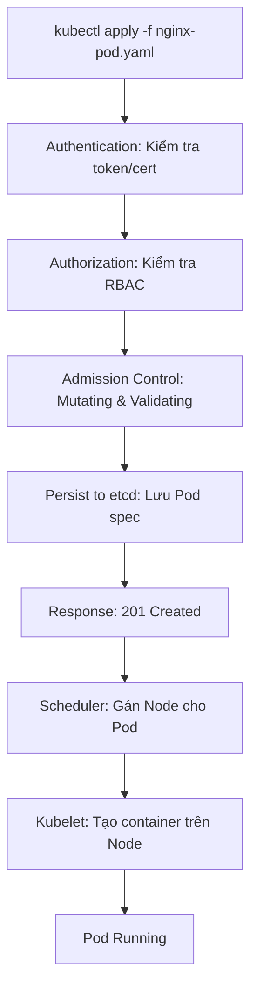

# Chi Tiết về kube-apiserver trong Kubernetes

## Giới thiệu

kube-apiserver là thành phần cốt lõi của Control Plane trong Kubernetes, đóng vai trò là "cửa ngõ" duy nhất để tương tác với cụm. Nó cung cấp REST API cho tất cả các thao tác quản lý tài nguyên, đảm bảo tính bảo mật, nhất quán và điều phối các thành phần khác trong hệ thống.

## Chức năng chính của kube-apiserver

### 1. Cung cấp REST API
- Là giao diện chính để tạo, đọc, cập nhật và xóa (CRUD) các đối tượng Kubernetes như Pod, Deployment, Service, ConfigMap, v.v.
- Hỗ trợ các phương thức HTTP: GET, POST, PUT, DELETE, PATCH.
- API được tổ chức theo phiên bản (ví dụ: `/api/v1/pods`), và hỗ trợ các nhóm API mở rộng (extensions).

### 2. Xác thực và Ủy quyền
- **Authentication (Xác thực):** Kiểm tra danh tính của người dùng hoặc thành phần gửi request. Hỗ trợ nhiều phương thức như Token, Certificate, Basic Auth, OIDC, v.v.
- **Authorization (Ủy quyền):** Sau khi xác thực, kiểm tra quyền truy cập dựa trên RBAC (Role-Based Access Control), ABAC, hoặc Webhook. Ví dụ: Người dùng có quyền tạo Pod trong namespace cụ thể không?

### 3. Lưu trữ và Đồng bộ hóa
- Là thành phần duy nhất có quyền đọc/ghi trực tiếp vào etcd.
- Đảm bảo dữ liệu được lưu trữ an toàn và nhất quán.
- Hỗ trợ cơ chế Watch để theo dõi thay đổi dữ liệu theo thời gian thực.

> **Ghi chú quan trọng:** kube-apiserver là thành phần duy nhất trong Kubernetes có quyền cập nhật etcd. Các thành phần khác như Scheduler hay Controller Manager chỉ có thể đọc dữ liệu từ etcd thông qua kube-apiserver, không được phép ghi trực tiếp để đảm bảo tính bảo mật và nhất quán.

### 4. Admission Control
- **Mutating Admission Controllers:** Có thể sửa đổi request trước khi lưu (ví dụ: thêm default values, inject sidecar containers).
- **Validating Admission Controllers:** Kiểm tra tính hợp lệ của request theo chính sách (ví dụ: ngăn chặn Pod chạy với quyền root).

## Vòng đời của một Request trong kube-apiserver

Khi gửi một request (ví dụ: tạo Pod qua kubectl), kube-apiserver xử lý qua các giai đoạn sau:

1. **Tiếp nhận Request:** Nhận request từ client (kubectl, API calls, v.v.).
2. **Authentication:** Xác thực danh tính.
3. **Authorization:** Kiểm tra quyền.
4. **Admission Control:** Áp dụng các controller để sửa đổi và xác thực.
5. **Persistence:** Lưu vào etcd nếu thành công.
6. **Response:** Trả về kết quả cho client.

## Case Study: Quá trình Tạo một Pod

### Mô tả Chi tiết

Giả sử bạn muốn tạo một Pod đơn giản chạy Nginx. Bạn có file YAML như sau:

```yaml
apiVersion: v1
kind: Pod
metadata:
  name: nginx-pod
  namespace: default
spec:
  containers:
  - name: nginx
    image: nginx:latest
    ports:
    - containerPort: 80
```

Quá trình tạo Pod diễn ra như sau:

1. **Gửi Request:** Bạn chạy `kubectl apply -f nginx-pod.yaml`. kubectl gửi request POST đến kube-apiserver tại endpoint `/api/v1/namespaces/default/pods`.

2. **Authentication:** kube-apiserver kiểm tra kubeconfig (token hoặc cert) để xác thực bạn là người dùng hợp lệ.

3. **Authorization:** Kiểm tra RBAC: Bạn có role `create` trên resource `pods` trong namespace `default` không?

4. **Admission Control:**
   - Mutating: Có thể thêm default limits nếu không có.
   - Validating: Kiểm tra schema YAML hợp lệ, không vi phạm policy (ví dụ: image từ registry an toàn).

5. **Persist to etcd:** Nếu qua hết, lưu object Pod vào etcd với key như `/registry/pods/default/nginx-pod`.

6. **Response:** Trả về 201 Created cho kubectl.

7. **Tiếp tục:** Scheduler nhận watch event, gán Node. Kubelet trên Node tạo container qua CRI.

### Sơ đồ Luồng (Mermaid Chart)



Sơ đồ này minh họa luồng từ request đến Pod chạy, nhấn mạnh vai trò của kube-apiserver trong giai đoạn đầu.